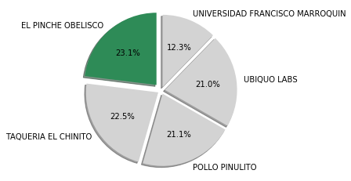
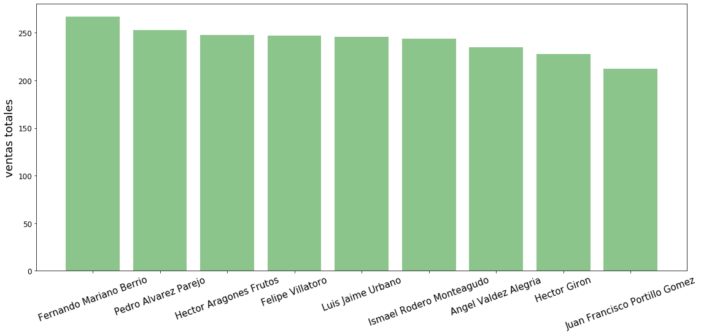

```{css, echo=FALSE}
h1, h2, h3 {
  text-align: center;
}

body {
  font-size: 12pt;
}
```

```{r echo = FALSE}
library(reticulate)
library(htmltools)
# knitr::knit_engines$set(python = reticulate::eng_python)
# knitr::opts_chunk$set(echo = TRUE, fig.align="center")
```

```{python librerias y data, echo=FALSE, comment=NA}
import numpy as np
import pandas as pd
import matplotlib.pyplot as plt
import seaborn as sns
import datetime
import io

dat = pd.read_csv("tabla_completa_clean.csv", encoding="latin")
# print(tabulate(dat,headers="keys",tablefmt="psql"))
# dat.to_html("prueba.html",justify="center",col_space = 20)
```

<center>En este reoporte se resume la información encontrada en el analisis sobre la información proporcionada por Distribuidora del Sur, S.A. Los datos que se analizaron pertenecen a las operaciones del año 2019. La información analizada pertenece a los viajes realizados a lo largo del año asi como detalles de los clientes, pilotos y el producto que se vendio. La información esta resumida en tablas y graficas para facilitar su comprensión.</center>


## **Situacion Actual:**
**Viajes hasta la fecha (Noviembre):** `r nrow(py$dat)`

**Clientes:** `r length(unique(py$dat$cliente_clean))`

**Pilotos:** `r length(unique(py$dat$piloto))`

**Ubicaciones:** `r length(unique(py$dat$ubicacion))`

**Tipo de Transportes:** `r length(unique(py$dat$unidad))`

## **Ultimos 11 meses:**

<center>Distribuidora del Sur no ha tenido una demanda estable a lo largo del año. Podemos ver que los meses con mayor demanda fueron Mayo y Julio. Tambien podemos notar que el peor mes fue el de Marzo.La siguiente grafica muestra el producto movido por la distribuidora a lo largo del año. Las devoluciones no se han tomado en cuenta para esta grafica.</center>

```{python echo=FALSE, results=FALSE}
df_ts_count = dat.groupby(["mes_anio"],as_index=False).q.count().sort_values(["mes_anio"])

plt.figure(figsize=(15,6))
plt.plot(df_ts_count["mes_anio"],df_ts_count["q"],linewidth=2,color="green",marker="o")
plt.xticks(rotation=45,fontsize=12)
plt.yticks(fontsize=12)
plt.title("Cantidad de Viajes Mensuales",fontsize=20)
plt.ylabel("# de Viajes",fontsize=16)
plt.show()
```

<center>La grafica de ventas mensuales es casi igual a la de cantidad de producto movido cada mes pero a diferencia de la grafica pasada aqui estan contabilizadas las devoluciones. Podemos ver que las devoluciones bajaron las ventas en general, el pico de Julio se redujo asi como el de Mayo, sin embargo sigue siendo el mes más alto.</center>

```{python echo=FALSE, results=FALSE}
df_ts_sum = dat[~dat["cliente"].str.contains("DEVOLUCION")].groupby(["mes_anio"],as_index=False).q.sum().sort_values(["mes_anio"])

plt.figure(figsize=(15,6))
plt.plot(df_ts_sum["mes_anio"],df_ts_sum["q"],linewidth=2,color="green",marker="o")
plt.xticks(rotation=45,fontsize=12)
plt.yticks(fontsize=12)
plt.title("Ventas Mensuales",fontsize=20)
plt.ylabel("Quetzales",fontsize=16)
plt.show()
```

## **Clientes**


```{python clientes_distinct, echo = FALSE, results=FALSE}
df_mejores_clientes = dat.groupby("cliente_clean",as_index=False).agg({"q_corregido":"sum"}
                                ).sort_values("q_corregido",ascending=False
                                ).rename(columns={"cliente_clean":"cliente",
                                                 "q_corregido":"ventas"})

df_mejores_clientes["porcentaje"] = round((df_mejores_clientes["ventas"]/df_mejores_clientes["ventas"].sum())*100,1)
df_mejores_clientes["porcentaje_accum"] = df_mejores_clientes.porcentaje.cumsum()

df_mejores_clientes = df_mejores_clientes.reset_index(drop=True)
df_mejores_clientes.rename(columns={"ventas":"ventas totales"},inplace=True)


html = df_mejores_clientes.to_html(justify="center",col_space = 25)

html = html.replace('class="dataframe"', 'class="dataframe" align="center"').replace("<td>",'<td align="center">')

with io.open("html/clientes_distinct.html", 'w', encoding='latin') as f:
    f.write(html)
```

```{r table_clientes_distinct,echo=FALSE}
htmltools::includeHTML("html/clientes_distinct.html")
```

<br>

<center>En la siguiente grafica podemos ver a los mejores clientes que tuvimos en los ultimos 11 meses. Estos clientes conforman el top 5 de nuestros clientes y sus ventas representan aproximadamente el 50% de nuestras ventas. (Incluir hasta el 80% significaba tomar casi a todos los clientes.)</center>

<center></center>

<center>Como podemos ver de estos clientes los 2 clientes más importantes son *El Pinche Obelisco* y *Taqueria El Chinito*</center>

## **Pilotos**

<center>Actualmente el promedio de viajes mensuales es de 22 por piloto, con lo que existen algunos pilotos que tendran que hacer más de un viaje al día. Si se contratara un piloto adicional el promedio bajaria a ~20 aproximadamente con lo cual cada piloto tendría apoximadamente 1 viaje por día (asumiendo que trabajan 5 días a la semana). En general no es de alta prioridad contratar más personal porque la demanda aun no es tan grande actualmente.</center>

<br>

```{python pilotos_distinct, echo = FALSE, results=FALSE}
html = pd.DataFrame({"piloto":dat.piloto.unique()}).to_html(justify="center",col_space = 25)

html = html.replace('class="dataframe"', 'class="dataframe" align="center"').replace("<td>",'<td align="center">')

with io.open("html/pilotos_distinct.html", 'w', encoding='latin') as f:
    f.write(html)
```

```{r table_pilotos_distinct,echo=FALSE}
htmltools::includeHTML("html/pilotos_distinct.html")
```

<br>

<center></center>
<br>
<center>Podemos ver  que el mejor piloto es Fernando Berrio. Para medir el desempeño de los pilotos se calculo el numero de viajes que los pilotos han hecho a lo largo del 2019 (excluyendo el mes de diciembre)</center>

## **Transportes:**
<br>
```{python transportes, echo = FALSE, results=FALSE}
html = dat.unidad.value_counts().to_frame().rename(columns={"cantidad":"viajes"})
html = html.to_html(justify="center",col_space = 25)

html = html.replace('class="dataframe"', 'class="dataframe" align="center"').replace("<td>",'<td align="center">')

with io.open("html/transportes.html", 'w', encoding='latin') as f:
    f.write(html)
```

```{r table_transportes,echo=FALSE}
htmltools::includeHTML("html/transportes.html")
```
<br>
</center> Con la información proporcionada no es posible obtener el numero de camiones o paneles con los que cuenta la empresa. Sin embargo, la tabla anterior cuantifica el numero de viajes que cada camion ha efectuado a lo largo del periodo estudiado. </center>

<br>

```{python promedios,echo = FALSE, results=FALSE}
df_prom_trans = dat.groupby("unidad",as_index=False).agg({"cantidad":"mean"})
df_prom_trans["cantidad"] = df_prom_trans["cantidad"].astype("int")
df_prom_trans.rename(columns={"cantidad":"carga promedio"})

html = df_prom_trans.to_html(justify="center",col_space = 25)

html = html.replace('class="dataframe"', 'class="dataframe" align="center"').replace("<td>",'<td align="center">')

with io.open("html/transportes_prom.html", 'w', encoding='latin') as f:
    f.write(html)
```

```{r table_promedios,echo=FALSE}
htmltools::includeHTML("html/transportes_prom.html")
```
<br>
<center>Los paneles permite llevar aproximadamente la mitad de la cantidad de producto que el camion pequeño, mientras que apenas representa una quinta parte de lo que un camion grande puede llevar.</center>


<br>

## **Flujo de Caja:**

<center>Actualmente existen 3 tipos de plazos de credito que se ofrece a nuestros clientes: 30, 60 y 90 días. En los ulitmos meses la cantidad de credito que se ha dado a nuestros clientes se conforma de la siguiente forma:</center>
<br>
```{python creditos, echo = FALSE, results=FALSE}
html = dat.credito.value_counts().to_frame().to_html(justify="center",col_space = 25)
html = html.replace('class="dataframe"', 'class="dataframe" align="center"').replace("<td>",'<td align="center">')

with io.open("html/creditos.html", 'w', encoding='latin') as f:
    f.write(html)
```

```{r table_creditos,echo=FALSE}
htmltools::includeHTML("html/creditos.html")
```
<br>
<center>En general los flujos son constantes y se empiezan a recibir en el mes de febrero. Se recomienda contabilizar los gastos de la empresa para determinar el flujo neto de efectivo que entra a la empresa cada mes.</center>

<br>

<center>Esto da como resulta la siguiente grafica que representa el dinero que cobraremos en los siguiente meses. ***NOTA:*** Las devoluciones se restaron en la fecha que se recogieron las devoluciones debido a que este dinero ya no representa dinero que pueda cobrarse.</center>

```{python echo=FALSE, results =FALSE}
df_liquidez = dat.groupby(["cobro","cobro_mes_anio"],as_index=False).q_corregido.sum().sort_values("cobro")

plt.figure(figsize=(15,6))
plt.bar(df_liquidez["cobro_mes_anio"],df_liquidez["q_corregido"],linewidth=2,color="teal",alpha=0.65)
plt.xticks(rotation=45,fontsize=12)
plt.yticks(fontsize=12)
plt.title("Cobros Mensuales",fontsize=20)
plt.ylabel("Quetzales",fontsize=16)
plt.show()
```

## **Devoluciones:**


```{python echo=FALSE,results=FALSE}

df_devoluciones = dat[dat["cliente"]=="EL GALLO NEGRO |||DEVOLUCION"].groupby("date",as_index=False).agg({"q_corregido":"sum"}).rename(columns={"date":"fecha","q_corregido":"devoluciones"})

df_devoluciones["devoluciones"] = df_devoluciones["devoluciones"]*-1

html = df_devoluciones.to_html(justify="center",col_space = 25)
html = html.replace('class="dataframe"', 'class="dataframe" align="center"').replace("<td>",'<td align="center">')

with io.open("html/devoluciones.html", 'w', encoding='latin') as f:
    f.write(html)

```

```{r table_devoluciones,echo=FALSE}
htmltools::includeHTML("html/devoluciones.html")
```

<br>
<center>El unico cliente que tiene registradas devoluciones es *"El Gallo Negro"*. Actualmente, el precio por producto es de 25 centavos, probablemente el cliente no esta satisfecho con el producto o con nuestras tarifas. Otra posibilidad para estas grandes devoluciones mensuales podría darse debido a un robo de los pilotos, la cual es una posibilidad que no se debe de descartar.</center>


## **Recomendaciones:**
* Debido a que los pilotos aun no tienen mucho trabajo ya que la demanda no es tan alta no se recomienda incrementar el personal.
* Se recomienda invertir en camiones grandes debido a que este tipo de camiones son los que mayor capacidad tienen y los que más se usan.
* Se recomienda mejorar la tarifa a nuestros clientes para evitar devoluciones.
* Se recomienda monitorear las devoluciones porque son una posible forma en la que los pilotos pueden robar.


