```{css, echo=FALSE}
h1, h2, h3 {
  text-align: center;
}

body {
  font-size: 12pt;
}

```

<style>
body {
text-align: justify}
</style>

Inversiones en Energía, S.A. de C.V. ha tenido un gran 2017 con una utilidad superior a los US$1 Millones. Durante estos 9 meses del 2018, han tenido una baja del 25% con respecto al año anterior en su margen operativo. En este análisis se buscó entender como fueron las operaciones del 2017 y en base a este análisis recomendar mejoras para el presente año.

**Datos Generales:**

+ Se cuenta con 74,239 postes en total.
+ Existen 10 tipos de servicios
+ Hay 4 ubicaciones de distribución

<br>

*Estado de Resultados - 2017*

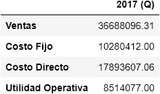

### **Analisis Mensual**

Las ganancias de la empresa son constantes a lo largo del año. Lo cual sugiere que no existe ciclicidad en los servicios a los postes y que nuestros clientes aceptaron las tarifas durante el 2017 ya que usaron nuestros servicios a lo largo del año. Al analizar los márgenes operativos por mes se notó que esta tendencia se mantenía en todos los meses, y en general el margen operativo se mantenía aproximadamente en **23%**. Debido a que el margen operativo ha caído un 25% en el presente  año se asume que este es aproximadamente **17%**. Esto representa una caída del **6%** que podría verse ligada a un aumento en las tarifas de la empresa o algun otro factor como la entrada de algún competidor. Este 6% es significativo ya que el margen a lo largo del 2017 nunca bajo del 23% y se mantuvo estable por lo que intuitivamente se concluye que es un comportamiento anómalo.

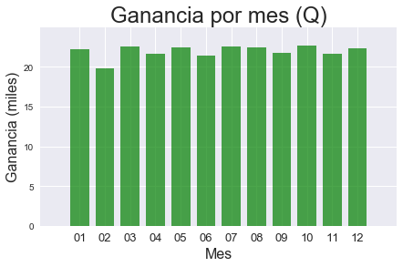 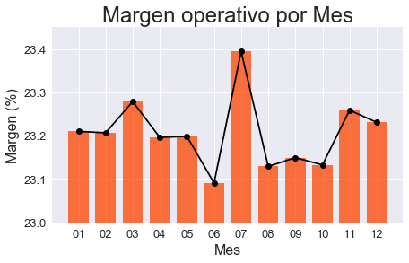

### **Postes**

**Pareto:**

Debido a la enorme cantidad de postes en los datos no podemos listar todos los postes que representan el 80% de las ganancias de la empresa. En su lugar, optamos por determinar qué porcentaje de las ganancias totales del 2017 son conformadas por el 20% de los postes (ordenados de mayor aporte a menor aporte marginal). Se concluyó que aproximadamente el **54%** de las ganancias son producto de casi **15,000 postes (~20%)**.

**Mantenimientos:**

La siguiente tabla muestra los 5 postes con la mayor cantidad de servicios. En general el tipo de servicio que más aparecía era el de *Otro*. Sin embargo, para el poste número uno los servicios que más se hicieron fueron: *Verificación de Medidores* y *Revisión*.

<center>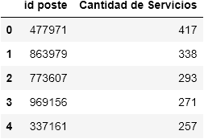</center>

**Servicios:**

Se encontró que el servicio de *Revisión* era el que se solicitaba más dentro de nuestra cartera de clientes. Sin embargo, al analizar la ganancia promedio para cada uno de estos productos determinamos que son 4 los servicios a los que más les ganamos, estos son: *Revisión*, *Verificación de Medidores*, *Revisión de Transformador* y *Cambio de Fusible*.

<center>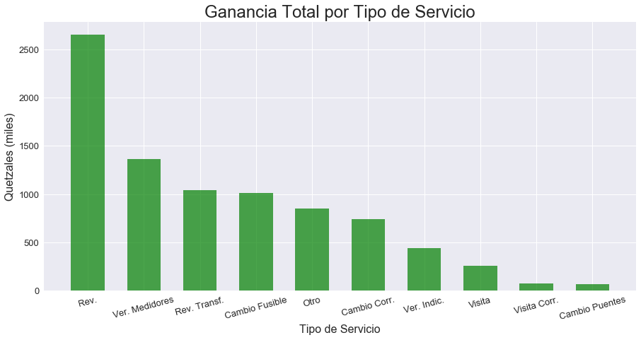</center>

<br>

<center>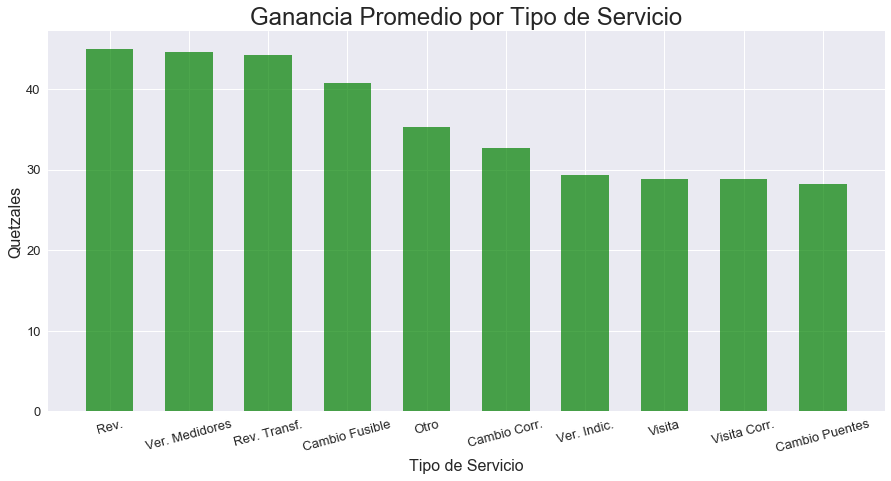</center>

<br>

Al analizar los márgenes por tipo de servicio, se determinó que los 3 mejores servicios (en términos de margen operativo), son: *Verificación de Medidores*, *Cambio de Puentes* y *Camio de Fusible*. No es sorpresa que 2 de estos 3 servicios hayan aparecido en las gráficas anteriores. Sin embargo, al observar también la frecuencia con la que se hacen los servicios nos damos cuenta de que es el servicio de *Revisión* el que más se hace, seguido por la *Verificación de Medidores*. En términos de cantidad de viajes, el *Cambio de Puentes* es el tipo de servicio que se hace en menor cantidad a pesar de que el margen es el segundo más alto.

<center>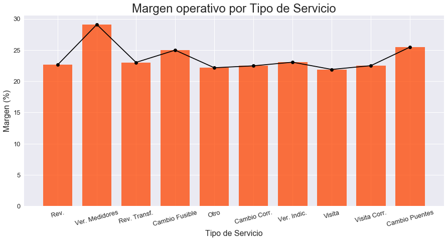</center>

<br>

<center>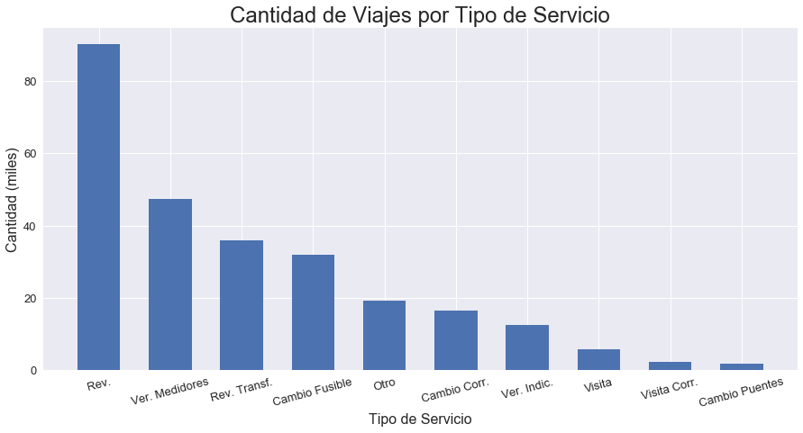</center>

### **Centros de Distribución**

Se encontró que existen 2 centros de distribución de donde salen la mayoría de los viajes. La diferencia contra los otros 2 centros de distribución es considerable. Esto nos hace preguntarnos si la razón por la que tenemos estos otros 2 centros de distribución es que esta considerablemente más cerca de algunos postes. No podemos analizar las distancias debido a la limitación de este análisis y porque no conocemos las coordenadas de nuestros centros de distribución, pero es algo que se debería de analizar porque la diferencia en viajes es enorme. Por otro lado, la diferencia en márgenes es leve (casi ~1%) y la ganancia promedio es un poco mayor para los centros de distribución con más viajes.

<center>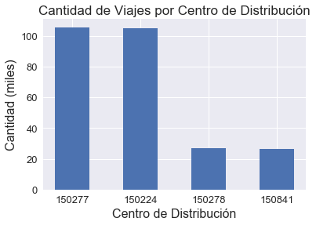 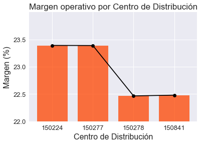</center>

<center>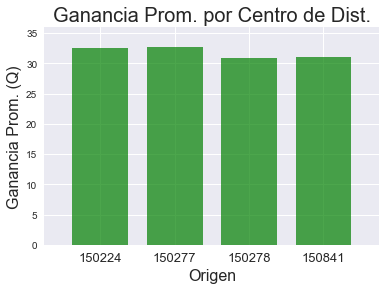</center>

### **Tiempos**

Podemos apreciar que en general si los tiempos de llegada al poste son más cortos entonces el margen sube. Sin embargo, a medida que este tiempo de llegada aumenta el margen disminuye considerablemente. Al analizar la cantidad de viajes por el tiempo que tomo podemos apreciar que el rango de tiempo más común es entre **75 y 120 minutos**. Algo interesante, es el hecho que la categoría de *120+* es la que menor ocurrencia tiene, lo cual es bueno ya que es la que menor margen tiene. 

<center>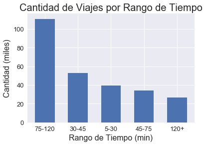 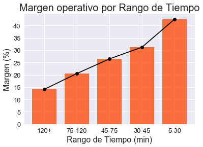 </center>

### **Recomendaciones y Conclusiones**

En base a lo analizado se llegó a las siguientes conclusiones:

+ Se recomienda hacer un análisis específicamente de los centros de distribución **150278**  y **150841**. Ya que la cantidad de viajes que manejan es sumamente baja y si la demanda cae puede que los costos fijos y administrativos de estos centros generen pérdidas debido a que no se llegó al *Break Even Point*. Estos centros de distribución son una debilidad para la empresa ya que no se aprovechan economías de escala que permitan diluir los costos del centro en todos sus viajes.

+ Se recomienda abrir un nuevo centro de distribución que permita bajar las distancias hacia los postes para que el mayor rango sea el de **30-45** aumentando en un ~5% el margen operativo. Posiblemente se podría cerrar uno de los centros con poca actividad por uno que mejore los tiempos de llegada.

+ No podemos ajustar la demanda por los servicios, pero podemos ajustar las tarifas. Se recomienda hacer un estudio para aumentar las tarifas de los servicios de **Revisiones** ya que este servicio es el que más se hace.

+ Se recomienda estudiar el año actual y determinar en **cual** de nuestros servicios nos hemos caído e intentar determinar el por qué ¿Aumento de precios? ¿Competencia?

+ Una disminución del 25% en el margen operativo del 2017 representa una caída del ~6% (margen de ~17%). Este cambio es significativo ya que en todo el 2017 se mantuvo en ~23%. Se recomienda analizar las ventas de este año.


### **Tarifario**

Debido a la gran cantidad de postes que la empresa atiende, usamos promedios para crear el tarifario. La separación la hacemos por **tiempo** y **tipo de servicio** ya que se debe de considerar no solo el tipo de servicio sino el tiempo que toma llegar a ese poste.

<center>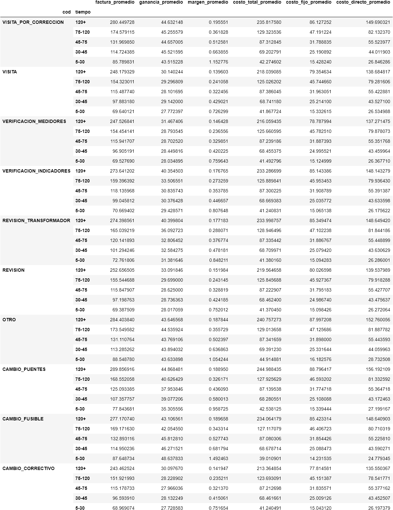</center>

<br>


